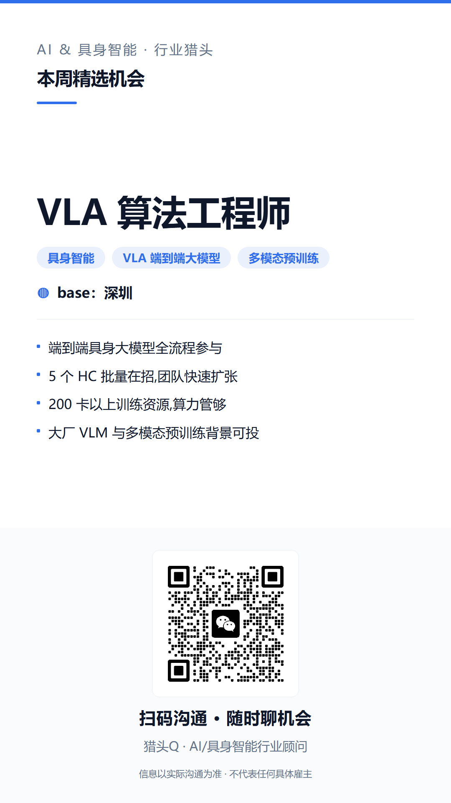
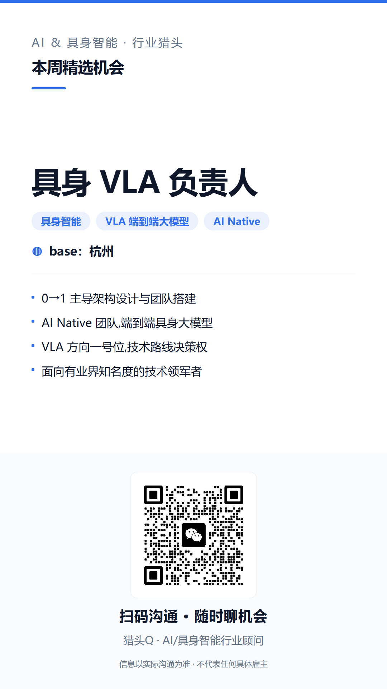
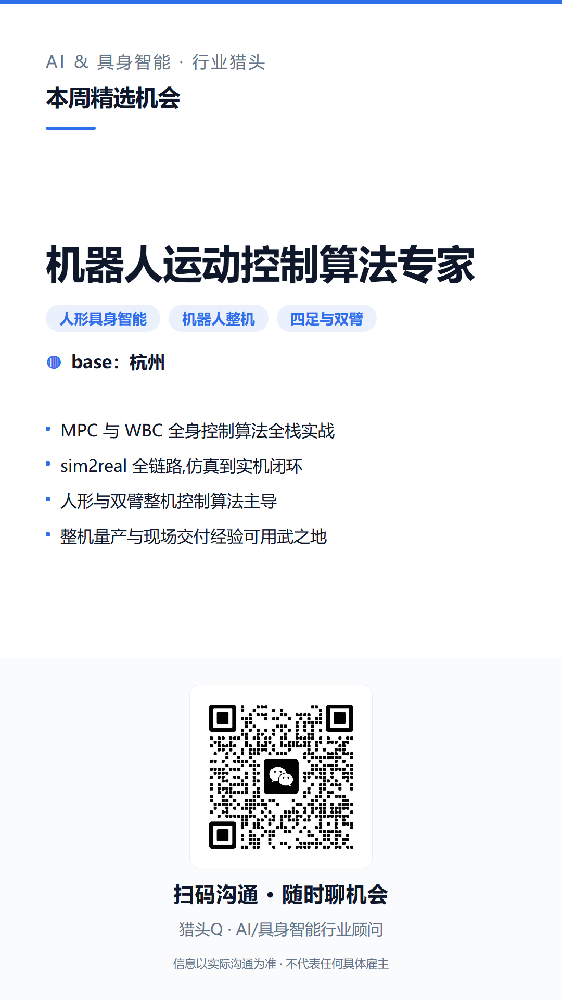
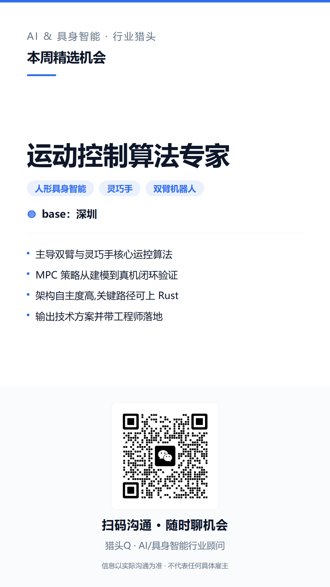

# AI & 具身智能 · 在招岗位

> VLA 端到端大模型 · 机器人运动控制 · 灵巧手与人形整机　|　更新于 2026-08-02

**在线版（推荐，手机友好）：https://CorrineZhao2026.github.io/ai-embodied-jobs/**

---

## 岗位速览

| 岗位 | Base | 方向 |
|---|---|---|
| [VLA 算法工程师](#vla-algorithm-engineer-shenzhen) | 深圳 | 具身智能 · VLA 端到端大模型 · 多模态预训练 |
| [具身 VLA 负责人](#embodied-vla-lead-hangzhou) | 杭州 | 具身智能 · VLA 端到端大模型 · AI Native |
| [机器人运动控制算法专家](#robot-motion-control-algorithm-expert-hangzhou) | 杭州 | 人形具身智能 · 机器人整机 · 四足与双臂 |
| [运动控制算法专家](#motion-control-algorithm-expert-beijing) | 北京 | 人形具身智能 · 灵巧手 · 双臂机器人 |
| [运动控制算法专家](#motion-control-algorithm-expert-shenzhen) | 深圳 | 人形具身智能 · 灵巧手 · 双臂机器人 |

---

### VLA 算法工程师

**Base：深圳**　|　具身智能 · VLA 端到端大模型 · 多模态预训练

- 端到端具身大模型全流程参与
- 5 个 HC 批量在招,团队快速扩张
- 200 卡以上训练资源,算力管够
- 大厂 VLM 与多模态预训练背景可投

### 具身 VLA 负责人

**Base：杭州**　|　具身智能 · VLA 端到端大模型 · AI Native

- 0→1 主导架构设计与团队搭建
- AI Native 团队,端到端具身大模型
- VLA 方向一号位,技术路线决策权
- 面向有业界知名度的技术领军者

### 机器人运动控制算法专家

**Base：杭州**　|　人形具身智能 · 机器人整机 · 四足与双臂

- MPC 与 WBC 全身控制算法全栈实战
- sim2real 全链路,仿真到实机闭环
- 人形与双臂整机控制算法主导
- 整机量产与现场交付经验可用武之地

### 运动控制算法专家

**Base：北京**　|　人形具身智能 · 灵巧手 · 双臂机器人

- 主导双臂与灵巧手核心运控算法
- MPC 策略从建模到真机闭环验证
- 架构自主度高,关键路径可上 Rust
- 输出技术方案并带工程师落地

### 运动控制算法专家

**Base：深圳**　|　人形具身智能 · 灵巧手 · 双臂机器人

- 主导双臂与灵巧手核心运控算法
- MPC 策略从建模到真机闭环验证
- 架构自主度高,关键路径可上 Rust
- 输出技术方案并带工程师落地

---

## 联系我

看到合适的岗位，或者想先了解行情、聊聊职业规划，都可以扫码找我。

**猎头Q · AI/具身智能行业顾问**

---

### 说明

- 本仓库仅同步岗位方向与需求要点，**不含客户公司名称与薪酬信息**，具体信息一对一沟通。
- 候选人信息严格保密，未经本人同意不向任何第三方推送简历。
